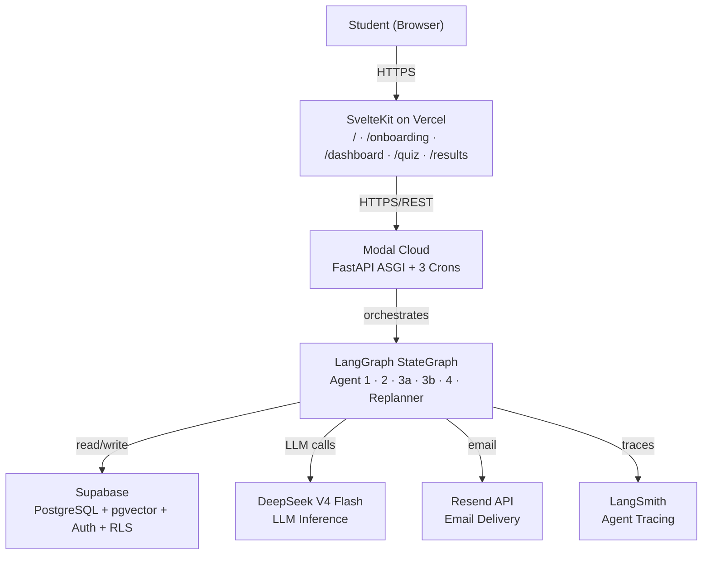

# SkillBridge — 10-Sprint Implementation Plan

> **Project:** SkillBridge — Multi-Agent Adaptive Learning System  
> **SDG:** SDG 4 — Quality Education  
> **Internship:** AICTE AI Automation & Intelligent Solutions — IBM SkillsBuild 2026  
> **Deadline:** 20 July 2026  
> **Stack:** SvelteKit · FastAPI · Modal · LangGraph · Supabase · DeepSeek V4 Flash · Resend  
> **References:** [project_idea.md](file:///F:/IBM%20internship/sunmission/Project/Planning/project_idea.md) · [system_design.md](file:///F:/IBM%20internship/sunmission/Project/Planning/system_design.md) · [system_design_doc.md](file:///F:/IBM%20internship/sunmission/Project/Planning/system_design_doc.md) · [project_structure.md](file:///F:/IBM%20internship/sunmission/Project/Planning/project_structure.md)

---

## Brainstorm Validation (Ultimate-Brainstorm Phase 1–3)

### Idea Restatement
**SkillBridge** is a multi-agent adaptive learning system that:
1. Analyzes a student's skill gaps against real Indian job market data (RAG over pgvector)
2. Generates a personalized weekly milestone plan
3. Sends a morning cheat sheet at 7:30 AM IST + a quiz link at 4:00 PM IST **every single day**
4. Self-corrects the learning plan when the student scores below 70%
5. Generates a LinkedIn post and weekly digest every Sunday

**The decisive differentiator:** competitors are static advisors. SkillBridge takes *daily action* and *adapts when you fail*.

### Constraints Extracted
| Constraint | Value |
|---|---|
| **Deadline** | 20 July 2026 (2–3 day build window from today, 17 July) |
| **Team** | Solo developer |
| **Budget** | ~$0/month (all free tiers) |
| **Scale** | 200 demo users, ~50 DAU |
| **Stack** | Locked — no decisions to re-litigate |
| **Auth timing** | Added last (Supabase Auth drop-in) |

### Key Technical Forks Already Resolved
1. **LLM:** DeepSeek V4 Flash — cheaper, working from India, confirmed
2. **Vector DB:** pgvector inside Supabase — no separate service needed
3. **Scheduling:** Modal cron — never sleeps, at-least-once guarantee
4. **Auth timing:** Add last — build with hardcoded `test_user_id`

---

## User Review Required

> [!IMPORTANT]
> **Deadline Reality Check:** The submission deadline is **20 July 2026** — 3 days from now. The 10-sprint plan below is structured as *logical* sprints (units of work), not calendar weeks. Given the 3-day window, sprints should be treated as **half-day to full-day work blocks**, not week-long iterations. Sprints 1–6 are the critical path (functional MVP). Sprints 7–10 are polish, auth, Agent 4, and evidence.

> [!WARNING]
> **DeepSeek API:** Confirm your DeepSeek V4 Flash API key is active and usable from India before Sprint 2. If there are rate-limit issues during cron burst (50 users × concurrent calls), `asyncio.Semaphore(10)` is already designed into the plan.

> [!IMPORTANT]
> **Job Skills Dataset:** Sprint 1 requires the `job_skills` dataset. The open question (OQ1) from system_design_doc.md — what is the data source? — must be answered before Agent 1 can be tested. **Plan:** Manually curate 100–200 `(role, skill, importance_level)` rows covering 5–10 target roles (backend dev, frontend dev, data analyst, ML engineer, etc.) and embed them during Sprint 1.

---

## Open Questions

> [!IMPORTANT]
> **OQ4 — DeepSeek cron burst:** 50 concurrent LLM calls at 7:30 AM. Add `asyncio.Semaphore(10)` to cron handlers. Already designed into Sprint 3.

> [!NOTE]
> **OQ2 — Quiz access control:** `quiz_id = {user_id}_{date}_{slug}` is sufficient as an access token for MVP. No JWT check needed on `GET /quiz/{quiz_id}`.

> [!NOTE]
> **OQ3 — Missed days:** Cron fires regardless. If student has no active learning plan, `send_brief_for_user()` returns early (idempotency check handles it).

---

## Architecture Summary



---

## Sprint Overview

```mermaid
gantt
    title SkillBridge Sprint Plan — Critical Path
    dateFormat HH:mm
    axisFormat %H:%M

    section Day 1
    Sprint 1 — Infra & DB          :s1, 00:00, 3h
    Sprint 2 — Agent 1 (Gap)       :s2, after s1, 3h
    Sprint 3 — Agent 2 (Planner)   :s3, after s2, 2h
    Sprint 4 — Agent 3a (Morning)  :s4, after s3, 2h

    section Day 2
    Sprint 5 — Agent 3b (Quiz)     :s5, 00:00, 4h
    Sprint 6 — FastAPI + Modal     :s6, after s5, 2h
    Sprint 7 — Frontend            :s7, after s6, 4h

    section Day 3
    Sprint 8 — Agent 4 + Auth      :s8, 00:00, 3h
    Sprint 9 — LangSmith + Polish  :s9, after s8, 2h
    Sprint 10 — Evidence + Submit  :s10, after s9, 3h
```



| Sprint | Name | Critical Path | Duration |
|--------|------|---------------|----------|
| 1 | Infrastructure & Database | ✅ YES | ~3h |
| 2 | Agent 1 — Skill Gap Analyzer | ✅ YES | ~3h |
| 3 | Agent 2 — Learning Path Planner | ✅ YES | ~2h |
| 4 | Agent 3a — Morning Brief | ✅ YES | ~2h |
| 5 | Agent 3b — Quiz Conductor + Evaluator | ✅ YES | ~4h |
| 6 | FastAPI + Modal Deployment | ✅ YES | ~2h |
| 7 | SvelteKit Frontend | ✅ YES | ~4h |
| 8 | Agent 4 + Supabase Auth | ⚡ High | ~3h |
| 9 | LangSmith Tracing + Polish | ⚡ High | ~2h |
| 10 | Evidence, PPT, Submission | ⚡ High | ~3h |

---

## Proposed Changes

---

### Sprint 1 — Infrastructure & Database Setup

**Goal:** Supabase project live, schema applied, pgvector working, job_skills embedded, secrets configured.

**Success criteria:** `SELECT COUNT(*) FROM job_skills` returns ≥ 100 rows with embeddings; all 6 tables exist.

#### [NEW] backend/src/core/config.py
```python
from pydantic_settings import BaseSettings

class Settings(BaseSettings):
    deepseek_api_key: str
    gemini_api_key: str
    supabase_url: str
    supabase_service_key: str
    resend_api_key: str
    langsmith_api_key: str

    class Config:
        env_file = ".env"

settings = Settings()
```

#### [NEW] backend/src/db/schema.sql
Full schema (6 tables + RLS + pgvector IVFFlat index) — directly from system_design.md §3.4.  
Apply via Supabase SQL editor in this order:
1. `CREATE EXTENSION IF NOT EXISTS vector;`
2. `profiles` table + RLS policy
3. `skill_gaps`, `learning_plans` (with partial unique index), `quiz_results`, `job_skills` (with IVFFlat index), `weekly_reports`

#### [NEW] backend/scripts/embed_job_skills.py
- Reads `job_skills_dataset.csv` (manually curated 100–200 rows of `role, skill, importance_level`)
- Calls `gemini-embedding-001` for each row to get 1536-dim vector
- Batch inserts into `job_skills` table via supabase-py

#### [NEW] backend/src/core/llm_client.py
```python
from langchain_deepseek import ChatDeepSeek

def get_llm(temperature: float = 0.2) -> ChatDeepSeek:
    return ChatDeepSeek(
        model="deepseek-chat",
        temperature=temperature,
        api_key=settings.deepseek_api_key
    )
```

#### [NEW] backend/src/agents/state.py
Full `SkillBridgeState` TypedDict as defined in project_idea.md.

#### [NEW] backend/src/db/client.py
```python
from supabase import create_client, Client

def get_supabase() -> Client:
    return create_client(settings.supabase_url, settings.supabase_service_key)
```

#### [NEW] backend/.env.example
All secret names, no values.

**Tests — Sprint 1:**

```
backend/tests/unit/test_config.py
  - test_settings_loads_from_env: asserts Settings() instantiates without KeyError
  - test_settings_missing_key_raises: asserts Settings() raises ValidationError when a key is missing

backend/tests/integration/test_db_connection.py
  - test_supabase_ping: get_supabase().table('profiles').select('id').limit(1).execute() returns no error
  - test_pgvector_extension: SELECT extname FROM pg_extension WHERE extname = 'vector' returns 1 row
  - test_job_skills_populated: SELECT COUNT(*) FROM job_skills returns >= 100

backend/scripts/test_embed_job_skills.py (manual smoke test)
  - embed_job_skills.py runs without error on 5 sample rows
```

---

### Sprint 2 — Agent 1: Skill Gap Analyzer

**Goal:** Agent 1 runs end-to-end: RAG retrieval → DeepSeek → Structured Output → saved to `skill_gaps`.

**Success criteria:** `run_skill_gap_analysis(user_id, goal, skills, hours)` returns a valid `SkillGapReport` JSON and inserts a row into `skill_gaps`.

#### [NEW] backend/src/retrieval/embeddings.py
```python
import google.generativeai as genai

def embed_query(text: str) -> list[float]:
    result = genai.embed_content(
        model="models/gemini-embedding-001",
        content=text
    )
    return result['embedding']
```

#### [NEW] backend/src/retrieval/vector_store.py
```python
def search_job_skills(query_vector: list[float], limit: int = 20) -> list[dict]:
    # pgvector cosine search via Supabase RPC
    return supabase.rpc('match_job_skills', {
        'query_embedding': query_vector,
        'match_count': limit
    }).execute().data
```
Requires a Supabase SQL function `match_job_skills` (created in Sprint 1 schema).

#### [NEW] backend/src/agents/skill_gap/schemas.py
```python
class SkillEntry(BaseModel):
    name: str
    required_level: int
    current_level: int
    gap_score: int
    priority: int

class SkillGapReport(BaseModel):
    skills: list[SkillEntry]
    overall_readiness_percent: int
    recommended_timeline_weeks: int
```

#### [NEW] backend/src/agents/skill_gap/nodes.py
- `analyze_gaps(state)`: embeds user goal → RAG → DeepSeek with Structured Output Parser → returns `skill_gap_report`
- `safety_net(state)`: if `overall_readiness_percent < 20` → force `recommended_timeline_weeks = 24`

#### [NEW] backend/src/agents/skill_gap/graph.py
```python
from langgraph.graph import StateGraph, END
from .nodes import analyze_gaps, safety_net

graph = StateGraph(SkillBridgeState)
graph.add_node("analyze_gaps", analyze_gaps)
graph.add_node("safety_net", safety_net)
graph.set_entry_point("analyze_gaps")
graph.add_edge("analyze_gaps", "safety_net")
graph.add_edge("safety_net", END)
skill_gap_graph = graph.compile()
```

#### [NEW] backend/src/prompts/skill_gap_analyzer.md
Amit 6-part template: Persona | Goal | Context | Task | Field Rules | Constraints (temperature=0.2).

**Tests — Sprint 2:**

```
backend/tests/unit/test_skill_gap_nodes.py
  - test_analyze_gaps_returns_schema: mock DeepSeek response; assert output matches SkillGapReport schema
  - test_safety_net_forces_24_weeks: pass state with readiness=15; assert timeline becomes 24
  - test_safety_net_noop_above_20: pass state with readiness=50; assert timeline unchanged
  - test_gap_score_calculation: assert gap_score = required_level - current_level per entry

backend/tests/unit/test_retrieval.py
  - test_embed_query_returns_1536_dims: assert len(embed_query("backend dev")) == 1536
  - test_search_returns_list: mock supabase RPC; assert search returns list[dict]

backend/evals/test_skill_gap.py (agent quality eval)
  - test_schema_valid: run Agent 1 with fixture goal; assert output is valid SkillGapReport
  - test_readiness_in_range: assert 0 <= overall_readiness_percent <= 100
  - test_no_invented_skills: assert all skill names appear in the RAG context (no hallucination)
  - test_priority_ordering: assert skills sorted by gap_score descending

backend/tests/integration/test_skill_gap_e2e.py
  - test_full_agent1_pipeline: run skill_gap_graph.invoke() with a real test user; assert row inserted in skill_gaps
```

---

### Sprint 3 — Agent 2: Learning Path Planner

**Goal:** Agent 2 receives `SkillGapReport` and produces a valid `MilestoneList` saved to `learning_plans`.

**Success criteria:** `run_learning_planner(user_id, skill_gap_report, hours_per_week)` returns milestones with topics, subtopics, and free resource URLs; row inserted in `learning_plans`.

#### [NEW] backend/src/agents/learning_planner/schemas.py
```python
class Milestone(BaseModel):
    week: int
    topic: str
    daily_subtopics: list[str]  # 5 items (Mon-Fri)
    free_resources: list[str]   # YouTube/GitHub/Coursera free URLs
    milestone_id: str           # slugified topic

class MilestoneList(BaseModel):
    milestones: list[Milestone]
    total_weeks: int
```

#### [NEW] backend/src/agents/learning_planner/nodes.py
- `plan_milestones(state)`: takes `skill_gap_report` + `hours_per_week` → DeepSeek (temp=0.2, Structured Output) → returns `MilestoneList`
- Writes to `learning_plans` table with `is_active=True`

#### [NEW] backend/src/agents/learning_planner/graph.py
Single-node graph. Entry: `plan_milestones` → END.

#### [NEW] backend/src/prompts/learning_planner.md
6-part prompt: assigns free resources only (YouTube/GitHub/Coursera free).

**Tests — Sprint 3:**

```
backend/tests/unit/test_learning_planner_nodes.py
  - test_plan_milestones_returns_schema: mock DeepSeek; assert output is valid MilestoneList
  - test_daily_subtopics_count: assert len(milestone.daily_subtopics) == 5 for each milestone
  - test_free_resources_only: assert all URLs are from youtube.com, github.com, or coursera.org
  - test_total_weeks_matches: assert MilestoneList.total_weeks == len(milestones)
  - test_milestone_ids_unique: assert all milestone_id values are unique

backend/evals/test_learning_planner.py
  - test_milestone_schema_valid: run Agent 2 with fixture gap report; assert valid MilestoneList
  - test_resources_are_free: assert no paid resource URLs in output
  - test_weeks_align_with_hours: assert planned weeks are realistic for given hours_per_week

backend/tests/integration/test_planner_e2e.py
  - test_agent1_into_agent2: run Agent 1 then feed output to Agent 2; assert learning_plans row inserted
  - test_only_one_active_plan: call Agent 2 twice; assert partial unique index prevents duplicates (raises on second)
```

---

### Sprint 4 — Agent 3a: Morning Brief Generator

**Goal:** Morning Brief agent generates cheat sheet JSON, renders HTML, sends via Resend, and logs idempotency key.

**Success criteria:** `run_morning_brief(user)` produces a valid `MorningBrief` JSON, sends email via Resend, and inserts a `quiz_results` row with `sent_at` populated.

#### [NEW] backend/src/agents/daily_checkin/morning_brief.py
- `generate_brief(topic, milestone_description)` → DeepSeek (temp=0.7) → `MorningBrief` JSON
- `render_brief_html(brief)` → renders `email/templates/morning_brief.html`
- `send_morning_brief_email(user, html)` → Resend SDK
- `run_morning_brief(user)` → idempotency check → generate → render → send → log `sent_at`
- `run_for_all_users()` → fetch active users → `asyncio.gather(*[run_morning_brief(u) for u in users], return_exceptions=True)` with `asyncio.Semaphore(10)`

#### [NEW] backend/src/agents/daily_checkin/schemas.py (MorningBrief)
```python
class MorningBrief(BaseModel):
    key_concepts: list[str]    # exactly 5 items
    misconceptions: list[str]  # exactly 2 items
    mnemonic: str
    think_about: list[str]     # exactly 3 items
    topic: str
```

#### [NEW] backend/email/client.py
```python
import resend

def send_email(to: str, subject: str, html: str) -> None:
    resend.api_key = settings.resend_api_key
    resend.Emails.send({
        "from": "SkillBridge <briefs@skillbridge.app>",
        "to": to,
        "subject": subject,
        "html": html
    })
```

#### [NEW] backend/email/templates/morning_brief.html
Polished HTML email template with inline CSS. Sections: Topic header, Key Concepts, Misconceptions, Mnemonic box, Think-About questions.

#### [NEW] backend/src/prompts/morning_brief.md
6-part prompt (temperature=0.7 — friendly, encouraging tone, each concept under 20 words).

#### [NEW] backend/crons/morning_brief_cron.py
```python
@app.function(schedule=modal.Cron("0 2 * * *"))
async def morning_brief_cron():
    from src.agents.daily_checkin.morning_brief import run_for_all_users
    await run_for_all_users()
```

**Tests — Sprint 4:**

```
backend/tests/unit/test_morning_brief.py
  - test_generate_brief_schema: mock DeepSeek; assert output is valid MorningBrief
  - test_key_concepts_count: assert len(brief.key_concepts) == 5
  - test_misconceptions_count: assert len(brief.misconceptions) == 2
  - test_think_about_count: assert len(brief.think_about) == 3
  - test_idempotency_check: if quiz_results row exists today, run_morning_brief() returns early without calling Resend
  - test_semaphore_limits_concurrency: mock 20 users; assert max 10 concurrent LLM calls at once

backend/tests/unit/test_email_client.py
  - test_send_email_calls_resend: mock resend.Emails.send; assert called with correct from/to/subject
  - test_send_email_raises_on_bad_key: assert raises on invalid API key (mocked 401)

backend/evals/test_morning_brief_quality.py
  - test_concept_length: assert each key_concept is under 20 words
  - test_mnemonic_present: assert brief.mnemonic is a non-empty string
  - test_no_markdown_outside_json: assert raw DeepSeek output is valid JSON (no ```json wrapper)

backend/tests/integration/test_morning_brief_e2e.py
  - test_run_morning_brief_end_to_end: run run_morning_brief(test_user) with real Resend test mode; assert quiz_results row inserted with sent_at
  - test_idempotency_on_double_run: call run_morning_brief twice; assert Resend called only once
```

---

### Sprint 5 — Agent 3b: Quiz Conductor + Evaluator + Replanner

**This is the most critical sprint. The conditional edge (score ≥ 70 → advance | score < 70 → replan) is the core differentiator.**

**Goal:** Full quiz loop — generate MCQs → email link → student submits → evaluate → conditional edge → advance OR replan.

**Success criteria:** 
- `score >= 70` → `current_milestone_index` incremented in DB
- `score < 70` → replanner rewrites failed + next milestone; `revision_count` incremented; max 3 rewrites enforced

#### [NEW] backend/src/agents/daily_checkin/quiz_conductor.py
- `generate_quiz(topic, milestone_description)` → DeepSeek (temp=0.3) → `QuizQuestion[5]`
- `save_quiz(user_id, quiz)` → INSERT into `quiz_results` with unique `quiz_id`
- `send_quiz_email(user, quiz_id)` → Resend: quiz link email
- `run_quiz_conductor(user)` → generate → save → email
- `send_links_for_all_users()` → batch with `asyncio.Semaphore(10)`

#### [NEW] backend/src/agents/daily_checkin/quiz_evaluator.py
- `evaluate_quiz(quiz_id, answers)` → DeepSeek (temp=0) → `QuizResult`
- `route_after_quiz(state)` → `"advance"` if score ≥ 70 else `"replanner"`
- `advance_milestone(state)` → UPDATE `learning_plans.current_milestone_index += 1`
- `send_result_email(user, result)` → Resend: pass or review email

#### [NEW] backend/src/agents/daily_checkin/replanner.py
```python
def replanner_node(state: SkillBridgeState) -> SkillBridgeState:
    if state['plan_revision_count'] >= 3:
        # Hard cap — flag for mentor
        return {**state, 'progress_log': [..., 'MAX REWRITES REACHED']}
    
    updated = llm.invoke(replan_prompt, structured_output=MilestoneList)
    idx = state['current_milestone_index']
    new_plan = (
        state['learning_plan'][:idx] +
        updated.milestones +       # only failed + next 1
        state['learning_plan'][idx + 2:]
    )
    return {**state, 'learning_plan': new_plan, 'plan_revision_count': state['plan_revision_count'] + 1}
```

#### [NEW] backend/src/agents/daily_checkin/schemas.py (QuizQuestion, QuizResult)
```python
class QuizOption(BaseModel):
    index: int
    text: str

class QuizQuestion(BaseModel):
    question_id: str
    question: str
    options: list[QuizOption]  # exactly 4
    correct_index: int

class QuizResult(BaseModel):
    per_question: list[dict]   # {question_id, correct, feedback}
    overall_score: float
    summary_feedback: str
    recommendation: Literal["advance", "review"]
```

#### [NEW] backend/src/prompts/quiz_generator.md, quiz_evaluator.md, replanner.md
3 separate prompt files per Amit's 6-part template.

#### [NEW] backend/crons/quiz_conductor_cron.py
```python
@app.function(schedule=modal.Cron("30 10 * * *"))
async def quiz_conductor_cron():
    from src.agents.daily_checkin.quiz_conductor import send_links_for_all_users
    await send_links_for_all_users()
```

**Tests — Sprint 5:**

```
backend/tests/unit/test_quiz_conductor.py
  - test_generate_quiz_schema: mock DeepSeek; assert output is list[QuizQuestion] of length 5
  - test_quiz_has_4_options: assert len(question.options) == 4 for each question
  - test_quiz_id_format: assert quiz_id matches pattern {user_id_prefix}_{date}_{slug}
  - test_unique_quiz_id_constraint: INSERT two rows with same quiz_id; assert DB raises unique violation

backend/tests/unit/test_quiz_evaluator.py
  - test_score_calculation: 3 correct of 5 → score == 60.0
  - test_route_above_70: score=70 → route_after_quiz returns "advance"
  - test_route_below_70: score=60 → route_after_quiz returns "replanner"
  - test_advance_milestone_increments_index: mock DB; assert current_milestone_index += 1
  - test_deterministic_scoring: same answers scored twice → same score (temp=0 assertion)

backend/tests/unit/test_replanner_logic.py
  - test_surgical_splice: assert replanned plan keeps prefix + suffix; only replaces [idx:idx+2]
  - test_replanner_hard_cap: revision_count=3 → replanner returns state unchanged with log entry
  - test_revision_count_increments: call replanner once; assert plan_revision_count == 1
  - test_replanner_output_schema: mock LLM; assert updated milestones are valid MilestoneList
  - test_replanner_preserves_future_milestones: assert milestones beyond idx+2 unchanged

backend/evals/test_replanner.py
  - test_replanner_valid_milestone_list: run replanner with fixture; assert output is MilestoneList
  - test_replanner_length_correct: assert len(updated) == 2 (failed + next only)
  - test_replanner_adds_prerequisites: assert new milestone description mentions review/prerequisite

backend/evals/test_quiz_generation.py
  - test_exactly_5_questions: assert len(questions) == 5
  - test_4_options_per_question: assert all have exactly 4 options
  - test_correct_index_in_range: assert 0 <= correct_index <= 3

backend/tests/integration/test_quiz_e2e.py
  - test_full_quiz_advance_path: submit all-correct answers; assert milestone_index incremented in DB
  - test_full_quiz_replan_path: submit all-wrong answers; assert learning_plans.milestones updated and revision_count == 1
  - test_max_rewrites_enforced: run quiz fail 3 times; assert 4th fail does NOT update milestones
  - test_submit_endpoint: POST /submit with mock data; assert HTTP 200 with score + recommendation
```

---

### Sprint 6 — FastAPI + Modal Deployment

**Goal:** All 5 HTTP endpoints live on Modal. Three crons registered. `modal deploy` succeeds.

**Success criteria:** `curl POST https://<modal-url>/analyze` returns `{skill_gap_report, readiness_percent}`.

#### [NEW] backend/src/api/main.py
```python
from fastapi import FastAPI
from src.api.routers import analyze, plan, quiz, report

app = FastAPI(title="SkillBridge API")
app.include_router(analyze.router, prefix="/analyze")
app.include_router(plan.router, prefix="/plan")
app.include_router(quiz.router, prefix="/quiz")
app.include_router(report.router, prefix="/report")
```

#### [NEW] backend/src/api/routers/analyze.py
```python
@router.post("/")
async def analyze_skills(body: AnalyzeRequest) -> AnalyzeResponse:
    state = build_initial_state(body)
    result = await skill_gap_graph.ainvoke(state)
    return AnalyzeResponse(skill_gap_report=result['skill_gap_report'], ...)
```

#### [NEW] backend/src/api/routers/plan.py, quiz.py, report.py
Same pattern: validate input → invoke agent → return response. No business logic in routers.

#### [NEW] backend/src/api/deps.py
JWT validation for `/submit` and `/report` endpoints.

#### [NEW] backend/modal_app.py
```python
import modal

app = modal.App("skillbridge")

@app.function()
@modal.asgi_app()
def fastapi_app():
    from src.api.main import app as api
    return api

@app.function(schedule=modal.Cron("0 2 * * *"))
async def morning_brief_cron(): ...

@app.function(schedule=modal.Cron("30 10 * * *"))
async def quiz_conductor_cron(): ...

@app.function(schedule=modal.Cron("30 13 * * 0"))
async def weekly_report_cron(): ...
```

**Tests — Sprint 6:**

```
backend/tests/integration/test_api_endpoints.py
  - test_analyze_endpoint_returns_200: POST /analyze with valid body; assert HTTP 200 + valid SkillGapReport
  - test_plan_endpoint_returns_200: POST /plan with valid skill_gap_report; assert HTTP 200 + MilestoneList
  - test_quiz_get_returns_questions: GET /quiz/{valid_quiz_id}; assert HTTP 200 + 5 questions
  - test_quiz_get_404_on_invalid_id: GET /quiz/invalid; assert HTTP 404
  - test_submit_endpoint_returns_score: POST /submit with valid answers; assert HTTP 200 + score in [0,100]
  - test_report_endpoint_returns_stats: GET /report/{user_id}; assert HTTP 200 + weekly_stats present
  - test_analyze_then_plan_chain: POST /analyze → use output in POST /plan; assert consistent milestone plan

backend/tests/integration/test_modal_deploy.py (smoke test — manual)
  - test_fastapi_asgi_starts: modal serve runs without error
  - test_cron_functions_registered: modal app list shows 4 functions (1 web + 3 crons)
```

---

### Sprint 7 — SvelteKit Frontend

**Goal:** All 5 pages built, styled with Tailwind, deployed to Vercel, communicating with Modal API.

**Success criteria:** A student can visit the Vercel URL, submit onboarding form, see their dashboard, click a quiz link, and view results — end to end — with a hardcoded `test_user_id`.

#### [NEW] frontend/src/routes/+page.svelte (Landing)
- SSR, SEO meta tags, headline, CTA button → `/onboarding`
- Design: dark mode, gradient hero, SkillBridge tagline
- Tailwind classes, Google Fonts (Inter)

#### [NEW] frontend/src/routes/onboarding/+page.svelte
- Goal input, current skills (multi-select chips), hours/week selector
- `+page.server.js` action: POST to `/analyze` then POST to `/plan`; redirect to `/dashboard`

#### [NEW] frontend/src/routes/dashboard/+page.svelte
- Milestone progress list (MilestoneCard components)
- Score history (ProgressBar components)
- LinkedIn post card (LinkedInPostCard with Copy button)
- `+page.server.js` loads milestones from Supabase

#### [NEW] frontend/src/routes/quiz/+page.svelte (client-only)
- `export const ssr = false`
- Fetches `GET /quiz/{quiz_id}` from URL param
- Renders 5 MCQ QuizOption components
- Submit → POST `/submit` → redirect to `/results`

#### [NEW] frontend/src/routes/results/+page.svelte
- Shows score, per-question feedback, recommendation (advance / review)
- Animated score ring

#### [NEW] frontend/src/lib/components/
- `MilestoneCard.svelte` — topic, week, status badge
- `ProgressBar.svelte` — score history sparkline
- `LinkedInPostCard.svelte` — AI post text + Copy button (clipboard API)
- `QuizOption.svelte` — radio button with hover animation

#### [NEW] frontend/src/lib/api/analyze.js, quiz.js, report.js
Thin `fetch` wrappers; no UI logic.

**Tests — Sprint 7:**

```
frontend/src/lib/components/__tests__/ (Vitest + @testing-library/svelte)
  - test_milestone_card_renders: render MilestoneCard with mock props; assert topic and week displayed
  - test_milestone_card_status_badge: pass status='complete'; assert badge text is 'Complete'
  - test_progress_bar_renders: render ProgressBar with score=75; assert correct visual representation
  - test_linkedin_post_card_copy: render LinkedInPostCard; click Copy button; assert clipboard API called
  - test_quiz_option_selectable: render QuizOption; click option; assert selected state updates

frontend/src/lib/api/__tests__/
  - test_analyze_api_calls_correct_url: mock fetch; assert POST to VITE_API_URL + '/analyze'
  - test_quiz_api_passes_quiz_id: mock fetch; assert GET to /quiz/{quiz_id}

playwright/ or cypress/ (e2e — optional for MVP)
  - test_onboarding_flow: fill form → submit → dashboard loads with milestones
  - test_quiz_flow: navigate to /quiz?id=test; select answers; submit; results page shows score
```

---

### Sprint 8 — Agent 4 (Progress Report) + Supabase Auth

**Goal:** Weekly report agent works. Google OAuth login added as drop-in layer.

**Success criteria:** 
- `run_weekly_report(user_id)` generates a digest + LinkedIn post text, stores in `weekly_reports`, sends email
- Google OAuth login works; `/dashboard` redirect guard applied; `test_user_id` replaced with real session

#### [NEW] backend/src/agents/progress_report/nodes.py
- `aggregate_scores(state)`: reads week's `quiz_results` for user → calculates avg score, milestones completed
- `generate_report(state)`: DeepSeek (thinking mode, temp=0.8) → progress report HTML + LinkedIn post text
- `generate_linkedin_post(state)`: DeepSeek → celebratory LinkedIn post (stored separately in `weekly_reports`)

#### [NEW] backend/src/agents/progress_report/schemas.py
```python
class WeeklyReport(BaseModel):
    week_start: str
    milestones_completed: int
    avg_quiz_score: float
    linkedin_post_text: str
    report_html: str
```

#### [NEW] backend/crons/weekly_report_cron.py
```python
@app.function(schedule=modal.Cron("30 13 * * 0"))
async def weekly_report_cron():
    from src.agents.progress_report.graph import run_for_all_users
    await run_for_all_users()
```

#### [NEW] frontend/src/routes/login/+page.svelte
```svelte
<script>
  import { supabase } from '$lib/supabase';
  const loginWithGoogle = () => supabase.auth.signInWithOAuth({ provider: 'google' });
</script>
<button on:click={loginWithGoogle}>Sign in with Google</button>
```

#### [MODIFY] frontend/src/routes/+layout.server.js
Add session load + redirect: if no session → `/login`.

#### [NEW] frontend/src/hooks.server.js
Supabase session refresh hook.

**Tests — Sprint 8:**

```
backend/tests/unit/test_progress_report.py
  - test_aggregate_scores_correct: mock quiz_results with known scores; assert avg_quiz_score is correct
  - test_milestones_completed_count: mock 3 completed milestones; assert count == 3
  - test_linkedin_post_non_empty: mock DeepSeek; assert linkedin_post_text is non-empty string
  - test_weekly_report_schema: mock LLM; assert output is valid WeeklyReport

backend/tests/integration/test_progress_report_e2e.py
  - test_report_stored_in_db: run weekly report for test user; assert weekly_reports row inserted
  - test_unique_week_constraint: run weekly report twice same week; assert unique index prevents duplicate

frontend auth tests (manual verification)
  - test_google_oauth_redirects: click Sign in with Google → redirected to Google consent screen
  - test_dashboard_requires_auth: GET /dashboard without session → redirect to /login
  - test_session_persists: login → refresh page → still on dashboard (session cookie active)
```

---

### Sprint 9 — LangSmith Tracing + Error Handling + Polish

**Goal:** Every agent node is traced in LangSmith. Retry backoff on DeepSeek calls. Email templates polished.

**Success criteria:** LangSmith dashboard shows traces for Agent 1, 2, 3a, 3b, 4, and Replanner. DeepSeek failures trigger retry with exponential backoff. Screenshots taken for PPT.

#### [MODIFY] backend/src/core/observability.py
```python
import os
os.environ["LANGCHAIN_TRACING_V2"] = "true"
os.environ["LANGCHAIN_PROJECT"] = "skillbridge"
os.environ["LANGCHAIN_API_KEY"] = settings.langsmith_api_key
```

#### [MODIFY] backend/src/core/llm_client.py
Add exponential backoff decorator:
```python
from tenacity import retry, stop_after_attempt, wait_exponential

@retry(stop=stop_after_attempt(3), wait=wait_exponential(multiplier=1, min=1, max=4))
async def invoke_with_retry(llm, prompt):
    return await llm.ainvoke(prompt)
```

#### [MODIFY] backend/email/templates/*.html
Polished CSS: brand colors, card layout, mobile-responsive, footer with "powered by SkillBridge".

#### [MODIFY] backend/crons/ all cron files
Add `try/except` around per-user calls: log exception to LangSmith and continue batch.

**Tests — Sprint 9:**

```
backend/tests/unit/test_observability.py
  - test_langsmith_env_vars_set: after importing observability, assert LANGCHAIN_TRACING_V2 == "true"
  - test_langsmith_project_set: assert LANGCHAIN_PROJECT == "skillbridge"

backend/tests/unit/test_retry_backoff.py
  - test_retry_succeeds_on_third_attempt: mock LLM to fail twice then succeed; assert final result is success
  - test_retry_raises_after_3_failures: mock LLM to always fail; assert raises after 3 attempts
  - test_retry_delays_are_exponential: mock sleep; assert delay sequence is 1s, 2s, 4s

backend/tests/unit/test_error_handling.py
  - test_cron_continues_on_user_failure: one user throws; assert remaining users still processed
  - test_max_rewrite_logs_correctly: replanner at cap; assert progress_log contains 'MAX REWRITES REACHED'

backend/tests/integration/test_langsmith_traces.py (manual verification)
  - Run full pipeline; verify LangSmith dashboard shows traces for all 5 agents
  - Screenshot all traces for PPT evidence
```

---

### Sprint 10 — Evidence, PPT, and Submission

**Goal:** Live Vercel URL confirmed. LangSmith traces screenshot. Demo video recorded. PPT assembled. Lean Canvas PDF exported. Submission checklist complete.

**Success criteria:** All items in project_idea.md §Submission Checklist checked off.

#### Demo Script
```
1. Open SkillBridge landing page (Vercel URL)
2. Click onboarding → fill: goal="Backend dev job", skills=["Python basics"], hours=10
3. Submit → dashboard loads with milestones
4. Manually trigger morning brief (modal run) → show email in inbox
5. Manually trigger quiz (modal run) → click quiz link → submit wrong answers
6. Show plan replan in dashboard (milestones changed)
7. Submit correct answers → show "You passed!" + next milestone preview
8. Open LangSmith → show full trace with conditional edge decision
9. Show LinkedIn post card in dashboard → Copy button
```

#### [NEW] backend/.github/workflows/ci.yml
```yaml
name: CI
on: [push, pull_request]
jobs:
  test:
    runs-on: ubuntu-latest
    steps:
      - uses: actions/checkout@v3
      - run: pip install uv && uv pip install -r backend/pyproject.toml
      - run: pytest backend/tests/unit/ -v
      - run: pytest backend/evals/ -v
  frontend:
    runs-on: ubuntu-latest
    steps:
      - uses: actions/checkout@v3
      - run: cd frontend && npm ci && npm run build
```

**Submission Checklist (from project_idea.md):**
- [ ] IBM SkillsBuild certificate uploaded to dashboard
- [ ] Lean Canvas exported as PDF → submitted via "Submit Concept Note"
- [ ] Project PPT → submitted via "Final Deliverable"
- [ ] PPT includes: live Vercel URL + LangSmith trace screenshots + demo video link
- [ ] LangSmith traces showing Agent 3b conditional edge (self-correction proof)

---

## Testing Strategy

### Test Pyramid

```
                   ┌──────────────┐
                   │  E2E / Demo  │  (manual, Sprint 10)
                   │   (5 tests)  │
                  ┌┴──────────────┴┐
                  │  Integration   │  (pytest + real DB)
                  │  (15 tests)    │
                 ┌┴────────────────┴┐
                 │   Agent Evals    │  (schema + quality)
                 │   (12 tests)     │
                ┌┴──────────────────┴┐
                │    Unit Tests      │  (pytest + mocks)
                │    (35+ tests)     │
                └────────────────────┘
```

### Unit Tests (35+ tests across Sprints 1–9)

| Sprint | Test File | Key Assertions |
|--------|-----------|----------------|
| 1 | `test_config.py` | Settings load, missing key raises |
| 2 | `test_skill_gap_nodes.py` | Schema valid, safety net, gap score math |
| 2 | `test_retrieval.py` | Embed returns 1536 dims, search returns list |
| 3 | `test_learning_planner_nodes.py` | Schema, subtopic count, free resources only |
| 4 | `test_morning_brief.py` | Schema, concept count, idempotency, semaphore |
| 4 | `test_email_client.py` | Resend called correctly, raises on 401 |
| 5 | `test_quiz_conductor.py` | Schema, 4 options per question, quiz_id format |
| 5 | `test_quiz_evaluator.py` | Score math, routing, advance increments index |
| 5 | `test_replanner_logic.py` | Surgical splice, hard cap, revision count, future milestones preserved |
| 8 | `test_progress_report.py` | Avg score, milestone count, LinkedIn text non-empty |
| 9 | `test_retry_backoff.py` | Retry succeeds, raises after 3, delays are exponential |
| 9 | `test_error_handling.py` | Batch continues on failure, max rewrite logs |

### Agent Evals (12 tests — quality gates)

| Eval File | What It Validates |
|-----------|-------------------|
| `evals/test_skill_gap.py` | SkillGapReport schema, readiness in [0,100], no hallucinated skills, priority ordering |
| `evals/test_learning_planner.py` | MilestoneList schema, free resources only, weeks align with hours |
| `evals/test_quiz_generation.py` | Exactly 5 questions, 4 options each, correct_index in [0,3] |
| `evals/test_replanner.py` | MilestoneList schema, length=2, adds prerequisites |
| `evals/test_morning_brief_quality.py` | Concept under 20 words, mnemonic present, valid JSON |

### Integration Tests (15 tests)

| Test File | What It Covers |
|-----------|----------------|
| `test_db_connection.py` | Supabase ping, pgvector extension, job_skills populated |
| `test_skill_gap_e2e.py` | Full Agent 1 pipeline, row inserted in skill_gaps |
| `test_planner_e2e.py` | Agent 1 → Agent 2 chain, unique plan constraint |
| `test_morning_brief_e2e.py` | Resend test mode, quiz_results row inserted, double-run idempotency |
| `test_quiz_e2e.py` | Advance path, replan path, max rewrites, /submit endpoint |
| `test_api_endpoints.py` | All 5 HTTP endpoints return correct status + schema |
| `test_progress_report_e2e.py` | weekly_reports row inserted, unique week constraint |

### Frontend Tests (Vitest, 7 component tests + 2 API tests)

| Test | Assertion |
|------|-----------|
| MilestoneCard render | Topic and week displayed |
| MilestoneCard status badge | Correct badge for status |
| ProgressBar render | Visual representation correct |
| LinkedInPostCard copy | Clipboard API called on button click |
| QuizOption selectable | Selected state updates on click |
| analyze API URL | Calls correct endpoint |
| quiz API quiz_id | Passes quiz_id to URL |

### CI Enforcement
- GitHub Actions runs unit tests + evals on every push
- Frontend build check on every PR
- Integration tests run on `main` only (require real secrets)

---

## Verification Plan

### Automated Tests
```bash
# Backend — unit tests (no secrets required)
cd backend
pytest tests/unit/ -v --tb=short

# Backend — agent quality evals (requires DeepSeek key)
pytest evals/ -v --tb=short

# Backend — integration tests (requires all secrets)
pytest tests/integration/ -v --tb=short

# Frontend — component tests
cd frontend
npm run test

# Frontend — build check
npm run build
```

### Manual Verification
1. **Modal deploy**: `modal deploy modal_app.py` — verify 4 functions appear in Modal dashboard
2. **Morning cron test**: `modal run crons/morning_brief_cron.py` — verify email arrives in inbox
3. **Quiz flow test**: `modal run crons/quiz_conductor_cron.py` — click link, submit all-wrong answers, verify plan updates in dashboard
4. **LangSmith traces**: Open LangSmith → verify 5 agent traces with token counts and latencies
5. **Vercel deploy**: `git push origin main` — verify Vercel build succeeds and URL is live
6. **Google OAuth**: Login flow on Vercel URL — verify redirect and session persistence

---

## Stack Card (Final)

```
┌──────────────────────────────────────────────────┐
│  STACK CARD: SkillBridge                         │
├──────────────────────────────────────────────────┤
│  Approach:         Core Loop, Executed Perfectly │
│  Frontend:         SvelteKit + Tailwind (Vercel) │
│  Backend:          FastAPI on Modal (ASGI + cron)│
│  Agent Framework:  LangGraph StateGraph          │
│  Database:         Supabase PostgreSQL           │
│  Vector Search:    pgvector (inside Supabase)    │
│  Auth:             Supabase Auth + Google OAuth  │
│  LLM:              DeepSeek V4 Flash             │
│  Embeddings:       gemini-embedding-001 (once)   │
│  Email:            Resend (HTML templates)       │
│  Scheduling:       Modal Cron (3 functions)      │
│  Tracing:          LangSmith (all nodes)         │
│  Cost:             ~$0-5/mo at demo scale        │
│  Tests:            Unit (35+) · Evals (12)       │
│                    Integration (15) · FE (9)     │
│  Best first spike: Agent 3b conditional edge     │
│  Key risk:         DeepSeek burst → Semaphore(10)│
└──────────────────────────────────────────────────┘
```

---

*Plan generated: 2026-07-17*  
*Skill applied: ultimate-brainstorm + production-project-structure + system-design*  
*Based on: project_idea.md · system_design.md · system_design_doc.md · project_structure.md*  
*Project: SkillBridge — AICTE AI Automation & Intelligent Solutions, IBM SkillsBuild 2026*
