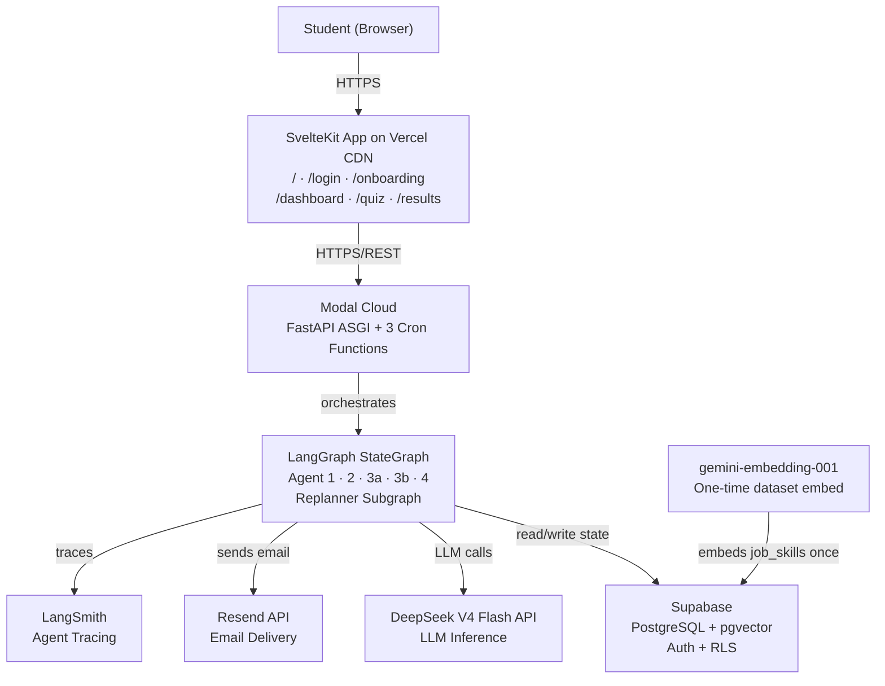
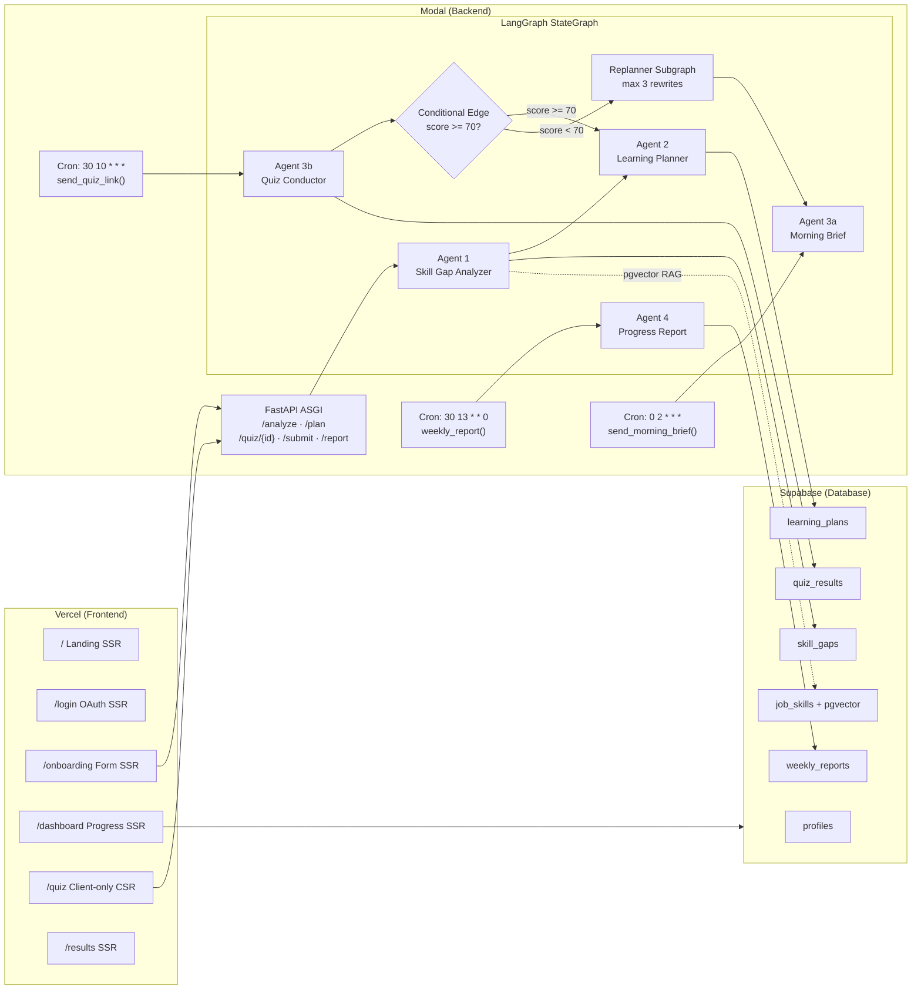
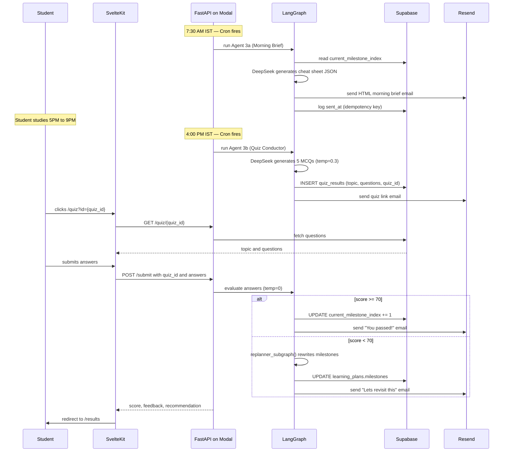
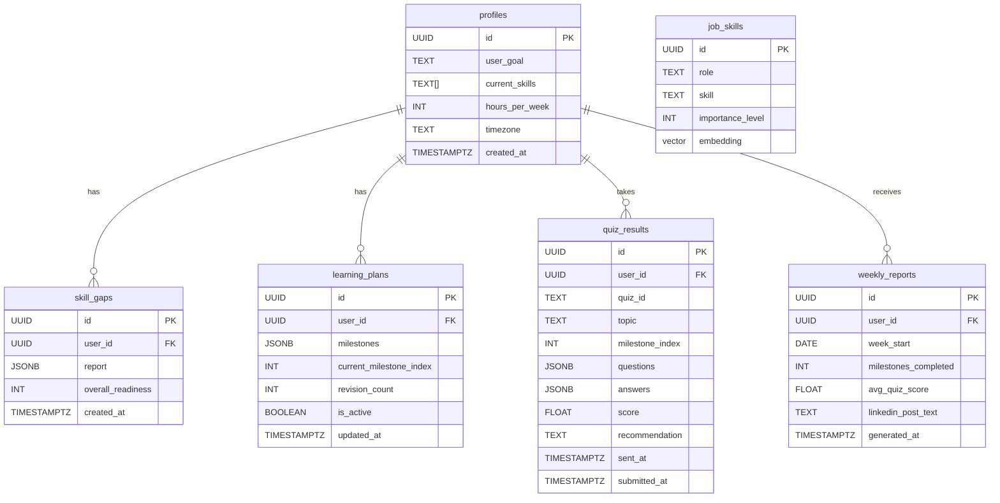
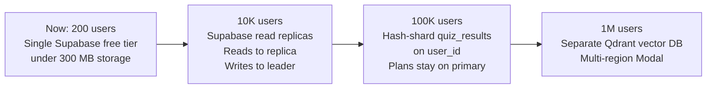
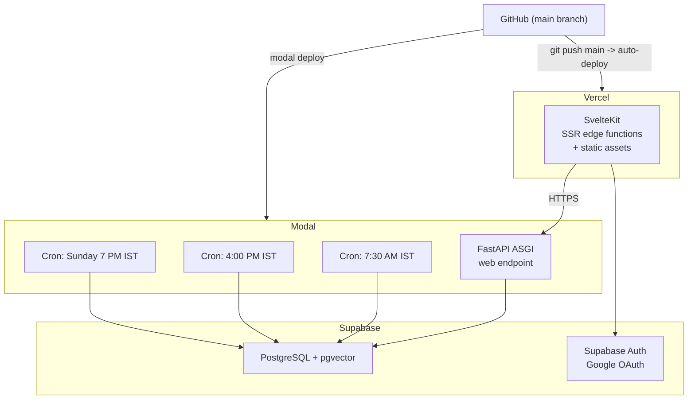

# SkillBridge — Formal System Design Document

> **Project:** SkillBridge — Multi-Agent Adaptive Learning System
> **SDG:** SDG 4 — Quality Education
> **Internship:** AICTE AI Automation & Intelligent Solutions — IBM SkillsBuild 2026
> **Deadline:** 20 July 2026
> **Author:** SkillBridge Team
> **References:** [project_idea.md](./project_idea.md) · [system_design.md](./system_design.md)

---

## 1. Requirements Summary

### 1.1 Problem Statement

Indian engineering students face three compounding failures:

1. **No personalization at scale** — one-size-fits-all college curricula ignore individual skill levels.
2. **Career-skill disconnect** — 65% of graduates are unemployable (NASSCOM 2025) due to misaligned learning.
3. **No action-taking guidance** — existing tools advise; none monitor, test, and adapt daily.

### 1.2 Functional Requirements

| ID | Requirement | Agent Responsible |
|----|-------------|-------------------|
| FR1 | Student onboards with goal, current skills, hours/week | Web form (SvelteKit) |
| FR2 | Skill gap analysis against real job market data via RAG | Agent 1 — Skill Gap Analyzer |
| FR3 | Personalized weekly milestone learning plan generated | Agent 2 — Learning Planner |
| FR4 | 7:30 AM IST daily — topic cheat sheet delivered by email | Agent 3a — Morning Brief |
| FR5 | 4:00 PM IST daily — quiz link email sent to student | Agent 3b — Quiz Conductor |
| FR6 | Student completes 5-MCQ quiz; answers auto-evaluated | Agent 3b — Quiz Conductor |
| FR7 | Score >= 70 → advance to next milestone | LangGraph conditional edge |
| FR8 | Score < 70 → replanner rewrites affected milestones | Replanner subgraph (max 3 rewrites) |
| FR9 | Sunday evening — weekly progress report + LinkedIn post text | Agent 4 — Progress Report |
| FR10 | Dashboard shows milestones, scores, LinkedIn draft | SvelteKit SSR dashboard |
| FR11 | Copy & Post button surfaces AI-crafted LinkedIn text | Frontend (no API approval needed) |

### 1.3 Non-Functional Requirements

| Attribute | Target | Rationale |
|-----------|--------|-----------|
| **Availability** | 99.9% (~8.7 hrs downtime/year) | Acceptable for demo/internship scale |
| **Latency** | Onboarding < 30 s · Email < 5 s · Quiz submit < 10 s | LLM inference is the bottleneck |
| **Throughput** | ~200 concurrent students; ~5-10 QPS peak | MVP/demo scale |
| **Durability** | No data loss on quiz results or learning plans | User progress is critical |
| **Cost** | ~$0/month at demo scale | Modal $30 free credits >> actual usage |
| **Security** | RLS on all Supabase tables; secrets via Modal secret store | Per Amit Tiwari security checklist |
| **Observability** | LangSmith tracing on every agent node | Evidence for PPT + debugging |

### 1.4 Constraints

| Constraint | Detail |
|------------|--------|
| Deadline | 20 July 2026 — 2-3 day build window |
| Budget | $0 operational cost (all free tiers) |
| Team | Solo developer |
| Stack | Locked: SvelteKit, FastAPI, Modal, Supabase, DeepSeek, Resend, LangGraph |
| LinkedIn API | Partner approval takes weeks — use Copy & Post pattern instead |

---

## 2. Architecture Diagram

### 2.1 System Context (C4 Level 1)



### 2.2 Component Diagram (C4 Level 2)



### 2.3 Daily Learning Flow Sequence



---

## 3. Component Descriptions

### 3.1 Agent 1 — Skill Gap Analyzer

**What it does:** Compares the student's declared skills against real job market requirements retrieved via RAG. Outputs a prioritized list of skill gaps with scores.

**Why this design:**
- pgvector cosine search over the `job_skills` table retrieves the top 20 relevant skills for the student's stated goal.
- DeepSeek V4 Flash with `temperature=0.2` and a Structured Output Parser ensures deterministic, schema-valid JSON.
- Safety net: `overall_readiness < 20%` forces a 24-week timeline to prevent impossible plans.

**Inputs:** `{user_goal, current_skills, RAG context}`
**Outputs:** `skill_gap_report` JSON → `skill_gaps` table

---

### 3.2 Agent 2 — Learning Path Planner

**What it does:** Decomposes the skill gap report into weekly milestones, each with a topic, daily subtopics, and free resource links (YouTube, GitHub, Coursera free tier only).

**Why this design:**
- Structured Output Parser enforces milestone schema — no free-form text that downstream agents cannot parse.
- Free resources only → zero cost for students → SDG 4 accessibility alignment.
- LangGraph checkpointer serializes the entire plan to `learning_plans.milestones` JSONB after this node, making it crash-safe.

**Inputs:** `{skill_gap_report, hours_per_week}`
**Outputs:** `learning_plan[]` JSON → `learning_plans` table

---

### 3.3 Agent 3a — Morning Brief Generator

**What it does:** At 7:30 AM IST daily, reads today's milestone topic and generates a scannable cheat sheet (5 concepts, 2 misconceptions, 1 mnemonic, 3 think-about questions) delivered as a polished HTML email.

**Why this design:**
- `temperature=0.7` allows creative mnemonics while accuracy constraints in the prompt prevent hallucination.
- Idempotency guard: checks if a `quiz_results` row with today's date already exists before sending — cron is safe to re-fire.
- `asyncio.gather` sends all active users' emails concurrently; total latency approximately 200 ms regardless of user count.

---

### 3.4 Agent 3b — Quiz Conductor + Evaluator

**What it does:** At 4:00 PM IST, generates 5 MCQs for today's topic and emails a quiz link. When the student submits, evaluates answers deterministically and triggers the conditional edge.

**Why this design:**
- Quiz generation at `temperature=0.3` (creative but not random); evaluation at `temperature=0` (deterministic, no lenience).
- `quiz_id = {user_id}_{date}_{slug}` — human-readable, unique, prevents cross-user access and duplicate inserts.
- Client-only SvelteKit `/quiz` page (`ssr=false`) — no server secrets exposed; pure browser interaction.

**Conditional Edge Logic:**

```python
def route_after_quiz(state: SkillBridgeState) -> str:
    if state["quiz_scores"][-1] >= 70:
        return "advance_milestone"
    return "replanner"
```

---

### 3.5 Replanner Subgraph — Self-Correction Loop

**What it does:** When a quiz score is below 70, surgically rewrites only the failed milestone + the next one, inserting prerequisites and review days. Guards against infinite loops with a hard cap of 3 rewrites per milestone.

**Why this design:**
- Surgical splice (not full plan overwrite) preserves all milestones beyond `current_index + 2`, keeping the student's progress intact.
- 3-rewrite hard cap prevents runaway LLM costs and flags persistent failures for mentor review.
- All replan events logged to LangSmith traces + `progress_log` field for PPT evidence.

**Key code pattern:**

```python
new_plan = (
    state["learning_plan"][:state["current_milestone_index"]]
    + updated_milestones  # only failed + next 1
    + state["learning_plan"][state["current_milestone_index"] + 2:]
)
```

---

### 3.6 Agent 4 — Progress Report Agent

**What it does:** Every Sunday at 7 PM IST, aggregates the week's quiz scores and milestone completions. Generates a motivational digest email and an AI-crafted LinkedIn celebration post surfaced in the dashboard.

**Why this design:**
- LinkedIn post uses DeepSeek thinking mode (`temperature=0.8`) — produces human-sounding posts without requiring LinkedIn Partner API approval.
- Copy & Post UX: student pastes manually — no API risk, still impressive because the AI writes the content.

---

### 3.7 RAG Pipeline (pgvector)

**What it does:** Converts the student's goal into a 1536-dim embedding, performs cosine similarity search over `job_skills`, and returns the top 20 role-specific skill requirements as context for Agent 1.

```
User goal
  → gemini-embedding-001 → 1536-dim query vector
  → pgvector cosine search on job_skills
  → Top 20 rows (role, skill, importance_level)
  → Assembled as RAG context string for DeepSeek prompt
```

**Why pgvector over Qdrant:** 5,000 rows × 1536-dim = ~30 MB IVFFlat index. Keeps the architecture to one database, one billing account, zero extra API keys.

---

## 4. API Contracts

### 4.1 HTTP Endpoints (FastAPI on Modal)

| Method | Endpoint | Request Body | Response | Notes |
|--------|----------|-------------|----------|-------|
| `POST` | `/analyze` | `{user_id, goal, skills[], hours_per_week}` | `{skill_gap_report, readiness_percent}` | Triggers Agent 1 |
| `POST` | `/plan` | `{user_id, skill_gap_report}` | `{learning_plan[], milestone_count}` | Triggers Agent 2 |
| `GET` | `/quiz/{quiz_id}` | — | `{topic, questions[5]}` | DB read only |
| `POST` | `/submit` | `{quiz_id, user_id, answers[]}` | `{score, feedback, recommendation}` | Triggers Agent 3b eval |
| `GET` | `/report/{user_id}` | — | `{weekly_stats, linkedin_post_text}` | Triggers Agent 4 |

### 4.2 Cron Functions (Internal, No HTTP)

| Function | Cron (UTC) | IST Equivalent | Action |
|----------|------------|----------------|--------|
| `send_morning_brief()` | `0 2 * * *` | 7:30 AM daily | Agent 3a for all active users |
| `send_quiz_link()` | `30 10 * * *` | 4:00 PM daily | Agent 3b for all active users |
| `weekly_report()` | `30 13 * * 0` | Sunday 7 PM | Agent 4 for all active users |

---

## 5. Data Model

### 5.1 Entity Relationship



### 5.2 Key Schema Constraints

| Constraint | SQL Pattern | Purpose |
|------------|-------------|---------|
| One active plan per user | `UNIQUE INDEX ... WHERE is_active = TRUE` | Prevents split-brain plans |
| Unique quiz per user-day | `quiz_id TEXT UNIQUE NOT NULL` | Cron idempotency |
| One weekly report per week | `UNIQUE INDEX (user_id, week_start)` | No duplicate Sunday reports |
| Score range validation | `CHECK (score BETWEEN 0 AND 100)` | Data integrity |
| Readiness range | `CHECK (overall_readiness BETWEEN 0 AND 100)` | Agent 1 output guard |

---

## 6. Caching Strategy

| Layer | Mechanism | What Is Cached | Invalidation |
|-------|-----------|----------------|--------------|
| **Modal function scope** | In-memory Python dict | Current day's milestone JSONB (re-read once per cron invocation) | Each cron invocation gets fresh read |
| **Supabase connection pool** | PgBouncer (built-in) | DB connection handles for FastAPI | Pool managed by Supabase |
| **SvelteKit SSR** | `+page.server.js` load function | Dashboard milestone data per request | Every page load — no stale state risk |
| **pgvector IVFFlat index** | PostgreSQL index on disk | 1536-dim embeddings for cosine search | Static — job_skills embedded once at setup |

No Redis layer needed at demo scale. Supabase pooling + Modal warm containers handle all read patterns.

---

## 7. Scaling Approach



**Horizontal scaling:** Modal auto-scales FastAPI containers on demand — no action needed.
**Vertical scaling:** Supabase Pro ($25/mo) adds read replicas — not needed until 10K+ users.
**Note:** Tiers beyond T1 are stated for completeness only; out of scope for this project.

---

## 8. Failure Modes and Resiliency

| Component | Failure Mode | Mitigation |
|-----------|-------------|------------|
| **DeepSeek API** | LLM call fails | Exponential backoff: 3 retries at 1s / 2s / 4s. On all-fail: skip user, log to LangSmith, continue batch. |
| **Modal cron** | Cron misfire or double-fire | At-least-once guarantee. UNIQUE `quiz_id` prevents duplicate inserts. Idempotency check in `send_morning_brief()`. |
| **Supabase** | DB unavailable | AWS multi-AZ managed by Supabase. Free tier is best-effort; upgrade to Pro for 99.9% SLA at scale. |
| **Resend** | Email delivery fails | Resend internal queuing and retry. `sent_at` only logged after HTTP 200 response. |
| **FastAPI cold start** | First request slow | Container stays warm within 5-min activity window. Cron pre-warms container. Cold start approximately 2 s. |
| **Replanner runaway** | Infinite replan loop | Hard cap: `plan_revision_count >= 3` — exit loop, log for mentor review. |

---

## 9. Security Design

```
Secret Storage
---------------------------------------------------------------
Modal Secret Store (encrypted at rest, never in git):
  DEEPSEEK_API_KEY        LLM inference
  GEMINI_API_KEY          Dataset embedding (one-time only)
  SUPABASE_URL            DB connection string
  SUPABASE_SERVICE_KEY    Server-side admin (bypasses RLS for cron)
  RESEND_API_KEY          Email delivery
  LANGSMITH_API_KEY       Agent tracing

Vercel Environment Variables (build-time, public-safe):
  VITE_API_URL            Modal web endpoint URL
  SUPABASE_ANON_KEY       RLS-gated public key

Supabase Row Level Security (enabled on all user tables):
  profiles       SELECT/UPDATE own row only (auth.uid() = id)
  skill_gaps     SELECT own rows only
  learning_plans SELECT/UPDATE own active plan only
  quiz_results   SELECT/INSERT own rows only
  weekly_reports SELECT own rows only
  job_skills     SELECT open to all (public job data, no PII)

FastAPI endpoint protection:
  /submit, /report: validate Supabase JWT from Authorization header
  quiz_id format:  {user_id_prefix}_{date}_{slug} prevents cross-user access
```

---

## 10. Deployment Architecture



**Deployment procedure:**
```
1. modal secret create skillbridge-secrets \
     DEEPSEEK_API_KEY=xxx GEMINI_API_KEY=xxx \
     SUPABASE_URL=xxx SUPABASE_SERVICE_KEY=xxx \
     RESEND_API_KEY=xxx LANGSMITH_API_KEY=xxx

2. modal deploy
   Deploys: FastAPI ASGI endpoint + 3 cron functions

3. git push origin main
   Triggers: Vercel auto-deploy (preview on PR, production on main)

4. Supabase SQL editor: apply schema migrations in order
```

**Deployment strategies:**

| Target | Strategy | Rollback |
|--------|----------|----------|
| Modal | Rolling — new container healthy, old retired | `modal deploy` previous version |
| Vercel | Atomic — instant switch | One-click in Vercel dashboard |
| Supabase schema | Manual SQL migration (MVP) | Manual reversal SQL |

---

## 11. Key Decisions

### ADR-01 — DeepSeek V4 Flash over GPT-4o

| | |
|-|-|
| **Decision** | DeepSeek V4 Flash via `langchain-deepseek` for all LLM inference |
| **Rationale** | 30-50x cheaper than GPT-4o at equivalent quality for structured JSON tasks. 1M context window. Thinking mode available for replanner. Confirmed working from India. |
| **Alternative** | GPT-4o — higher cost, 128K context, no free tier |
| **Trade-off** | No cross-provider fallback in MVP. If DeepSeek unavailable: skip that day's batch, log error. Acceptable at demo scale. |

### ADR-02 — pgvector inside Supabase over Qdrant

| | |
|-|-|
| **Decision** | pgvector extension in existing Supabase PostgreSQL |
| **Rationale** | 5,000 rows × 1536-dim = ~30 MB for IVFFlat index — trivially within free tier. Eliminates a separate DB, billing account, and network hop. No quality difference at this scale. |
| **Alternative** | Qdrant — more tunable ANN, separate service, extra API key |
| **Trade-off** | Migration to Qdrant warranted if `job_skills` exceeds 1M rows. Not a concern here. |

### ADR-03 — Modal cron over APScheduler + Render

| | |
|-|-|
| **Decision** | `@app.function(schedule=modal.Cron(...))` for all scheduled execution |
| **Rationale** | Render free tier containers sleep after 15 minutes — cron jobs silently fail. Modal never sleeps; at-least-once guarantee. $30/mo credits >> ~$4.50/mo actual cost. |
| **Alternative** | APScheduler on Render, or GitHub Actions cron — both have cold start / reliability risks |
| **Trade-off** | Platform lock-in to Modal for scheduling. Acceptable at this scale and deadline. |

### ADR-04 — Auth added as final drop-in layer

| | |
|-|-|
| **Decision** | Build all agents with hardcoded `test_user_id`; add Supabase Auth + Google OAuth last |
| **Rationale** | Auth does not gate any agent reasoning logic. Avoids the largest source of early dev friction. Clean drop-in via SvelteKit `hooks.server.js` without modifying any agent code. |
| **Alternative** | Auth-first development — slower, blocks all UI testing until OAuth is wired |
| **Trade-off** | No multi-user isolation during dev testing. Acceptable for MVP. |

### ADR-05 — LinkedIn Copy & Post over API Integration

| | |
|-|-|
| **Decision** | Generate LinkedIn post text with DeepSeek thinking mode; surface with a "Copy & Post" button |
| **Rationale** | LinkedIn Partner API approval takes weeks. The wow factor is the AI-written content, not the automation. Evaluators can read the post live in the dashboard. |
| **Alternative** | LinkedIn API auto-post — requires weeks of partner approval |
| **Trade-off** | Manual paste step for the student. Post quality compensates for the friction. |

---

## 12. Open Questions

| # | Question | Priority | Resolution Path |
|---|----------|----------|-----------------|
| OQ1 | What is the exact `job_skills` dataset source? (NASSCOM data, scraped LinkedIn JDs, manual curation?) | HIGH — needed before Agent 1 can be tested | Curate 50-100 role+skill rows manually; embed during Phase 1 setup |
| OQ2 | Should the quiz page require the student to be logged in, or is the `quiz_id` the access token? | MEDIUM | `quiz_id` as access token is sufficient for MVP; add auth guard in Phase 3 |
| OQ3 | What happens when a student misses a day (no quiz submission)? Does the cron still fire the next morning brief? | MEDIUM | Current design: cron fires regardless. Add a "missed day" flag if needed. |
| OQ4 | DeepSeek API rate limits during concurrent cron burst (50 users × simultaneous calls)? | HIGH — risk to cron reliability | Stagger with `asyncio.Semaphore(10)` — limits to 10 concurrent LLM calls |
| OQ5 | Resend free tier (3,000 emails/month) limits active users to ~30. What is the demo scale target? | MEDIUM | 30 active students = free tier; upgrade to Resend Starter ($20/mo) at full scale |
| OQ6 | Should the replanner notify the student by email when their plan is rewritten? | LOW | Already included in the "Let's revisit" result email; replan summary is shown |

---

## 13. Back-of-the-Envelope Estimates

```
Target users (demo):    200 students
Daily active:           ~50 students/day

QPS:
  Cron burst (7:30 AM): 50 emails in ~60s → ~5 API calls/second
  Cron burst (4:00 PM): 50 quiz emails    → ~5 API calls/second
  Quiz submissions:      50 × 1/day       → ~3 submissions/minute peak
  Dashboard loads:       100 SSR renders/day
  Average API QPS:       ~0.1 QPS
  Peak API QPS:          ~5-10 QPS (cron windows only)

Storage (year 1):
  quiz_results:   200 × 365 × 2 KB  = ~146 MB
  learning_plans: 200 × 10 KB       = ~2 MB
  job_skills:     5,000 × 6 KB      = ~30 MB (one-time)
  pgvector index: ~30 MB overhead
  Total:          < 300 MB → well within free tier (500 MB limit)

LLM cost (DeepSeek V4 Flash, 50 active users):
  Morning brief:  50 × 1,200 tokens × $0.14/1M = $0.008/day
  Quiz gen+eval:  50 × 2,000 tokens × $0.20/1M = $0.020/day
  Weekly report:  50 × 2,800 tokens/week        = ~$0.03/week
  Total/month:    ~$1.00/month → within Modal $30 free credits

Email volume (50 active users):
  Morning briefs: 50/day × 30 days = 1,500/month
  Quiz links:     50/day × 30 days = 1,500/month
  Results emails: 50/day × 30 days = 1,500/month
  Weekly reports: 50/week × 4      = 200/month
  Total:          ~4,700/month
  Note:           Resend free tier = 3,000/month → cap at 30 active users
                  OR upgrade to Resend Starter ($20/mo) for full 200-student scale
```

---

## 14. LangGraph State (Shared Memory)

```python
class SkillBridgeState(TypedDict):
    # User profile
    user_id: str
    user_goal: str                # "Get a backend dev job at a startup"
    current_skills: List[str]     # ["Python basics", "HTML/CSS"]
    hours_per_week: int           # 10

    # Agent 1 outputs
    skill_gap_report: dict        # {skills[], readiness_percent, timeline_weeks}

    # Agent 2 outputs
    learning_plan: List[dict]     # [{milestone, topic, daily_subtopics[], resources[], week}]
    current_milestone_index: int

    # Agent 3 state
    todays_topic: str
    current_quiz_id: str
    quiz_scores: List[float]      # history of all daily scores
    plan_revision_count: int      # hard limit: max 3 rewrites per milestone

    # Logging
    progress_log: List[str]       # timestamped entries synced to Supabase + LangSmith
```

**Persistence:** LangGraph checkpointer serializes state to `learning_plans.milestones` JSONB after every node. The graph survives Modal cold starts, pod restarts, and cron re-fires without losing position.

---

## 15. Final Design Score

| Diagnostic | Status | Evidence |
|------------|--------|----------|
| Functional + non-functional requirements | YES | Section 1.1 + 1.2 |
| QPS and storage estimated | YES | Section 13 |
| Every component has redundancy/fallback | YES | Section 8 — retry backoff, idempotency, multi-AZ |
| Database scaling strategy | YES | Section 7 — vertical now, replicas at 10K, sharding at 100K |
| Cache for read-heavy paths | YES | Section 6 — Modal in-memory, Supabase pool, pgvector index |
| Async paths using gather/queues | YES | asyncio.gather for batch emails; Modal cron for decoupled scheduling |
| Monitoring and alerting | YES | LangSmith traces, Supabase logs, progress_log field |
| Deployment strategy defined | YES | Section 10 — rolling Modal, atomic Vercel, manual migrations |

**Design Score: 8/8 diagnostics passed**

---

*Document generated: 2026-07-16*
*Skill: system-design-doc | References: project_idea.md + system_design.md*
*Project: SkillBridge — AICTE AI Automation & Intelligent Solutions, IBM SkillsBuild 2026*
